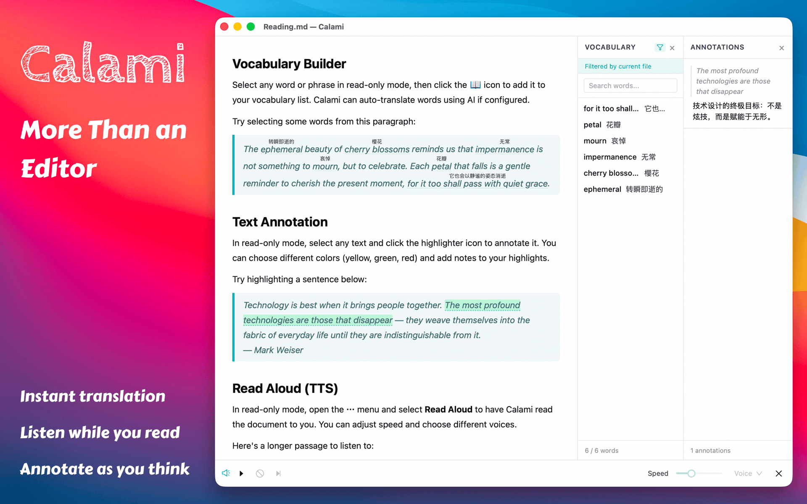
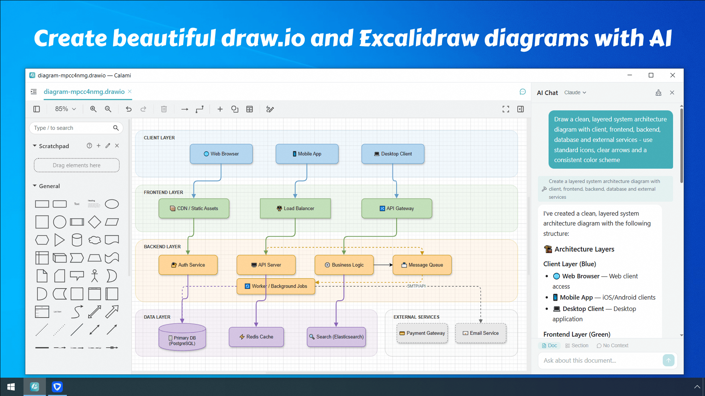
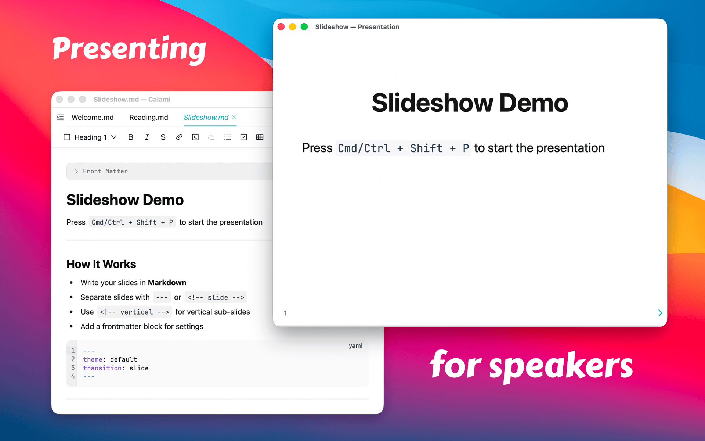
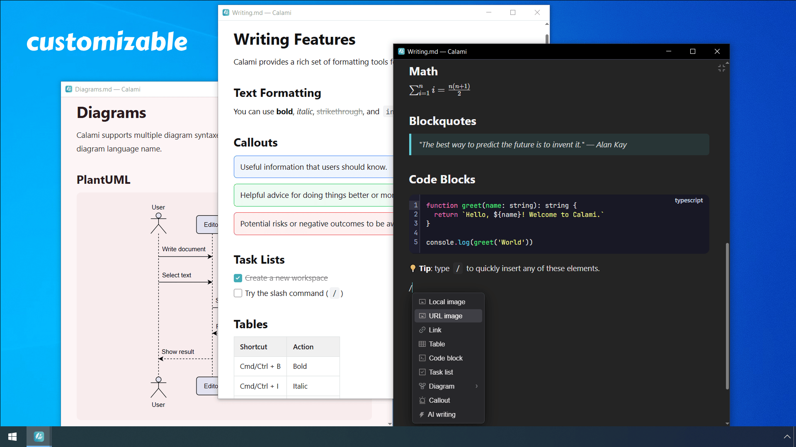
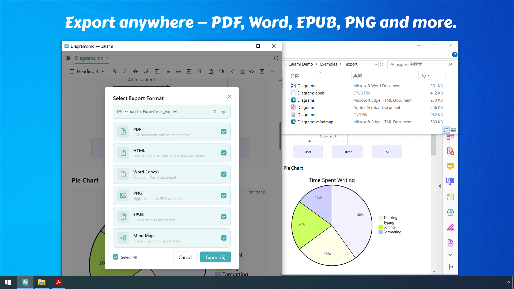

<h1 align="center">Calami</h1>

<strong>Leggi di più. Scrivi meglio. Tutto in Markdown.</strong>

<a href="https://calami.app">Sito web</a> · 
<a href="https://apps.apple.com/cn/app/calami/id6761129456">Mac App Store</a> · 
<a href="https://apps.microsoft.com/detail/9PG5SND2LL3H">Microsoft Store</a>

---

## Perché Calami?

La maggior parte delle app Markdown si concentra sulla scrittura. Calami è progettato per **leggere e scrivere** — un'unica app dove puoi redigere articoli, studiare documenti, annotare PDF e presentare slide, il tutto senza lasciare il tuo spazio di lavoro.

È leggero, multipiattaforma, e i tuoi file non lasciano mai il tuo computer.

## Funzionalità principali

### 📖 Lettura immersiva

Trasforma qualsiasi file Markdown in un'esperienza di lettura pulita, simile a un libro. Seleziona una parola per ottenere una traduzione istantanea, evidenzia passaggi con annotazioni colorate, o lascia che l'app ti legga ad alta voce.

### ✍️ Scrittura con IA

Passa dalla modalità testo formattato alla modalità sorgente in qualsiasi momento. Un assistente IA vive nella barra laterale — chiedigli di riassumere, continuare a scrivere, migliorare la tua prosa o tradurre. Porta la tua chiave API (OpenAI, Claude, Gemini o modelli locali funzionano tutti).

### 🎬 Presentazione

Trasforma qualsiasi file Markdown in una presentazione con un clic. Presenta le tue idee direttamente dalle tue note — senza bisogno di passare a PowerPoint o Google Slides.

### 🎨 Rendilo tuo

Scegli tra temi e skin integrati, o descrivi uno stile in linguaggio naturale e lascia che l'IA generi uno skin personalizzato per te. Regola font, spaziatura e layout secondo i tuoi gusti.

### 📤 Esporta ovunque

Un clic per esportare come PDF, HTML, Word, PNG, EPUB o mappa mentale. Pubblica direttamente su servizi di hosting immagini.

## Altri punti di forza

| Funzionalità | Descrizione |
| --------------- | --------------------------------------------------------------- |
| Diagrammi | 10+ motori — Mermaid, Excalidraw, Draw.io, PlantUML e altri |
| Crittografia file | Blocca i file sensibili con un PIN |
| Cronologia versioni | Sfoglia e ripristina snapshot precedenti |
| Formule matematiche | Supporto completo per matematica LaTeX |
| Lettore PDF e EPUB | Leggi e annota PDF ed EPUB con ricerca vocabolario |

## Download

## FAQ

<strong>In cosa Calami è diverso da Typora / Obsidian / Bear?</strong>

Calami tratta la lettura come un'esperienza di prima classe — modalità immersiva, traduzione istantanea, quaderno vocabolario, lettura bionica e sintesi vocale sono tutti integrati.

<strong>Funziona offline?</strong>

Sì. Tutto tranne l'IA basata su cloud funziona offline. Se usi un modello locale come Ollama, anche l'IA funziona senza internet.

<strong>I miei dati sono privati?</strong>

I tuoi file risiedono sul tuo computer come Markdown standard. Nessuna sincronizzazione cloud, nessun account richiesto. Le richieste IA vanno direttamente al provider scelto — Calami non vede mai i tuoi contenuti.

## Link

[Sito web](https://calami.app) · [Privacy Policy](https://calami.app/privacy) · [Galleria temi](https://calami.app/themes)

## Feedback

* 🐛 [Segnala un bug](https://github.com/calami-app/calami/issues)
* 💡 [Richiedi una funzionalità](https://github.com/calami-app/calami/issues)
* 📧 [Scrivici](mailto:support@calami.app)

---

Fatto con ❤️ dal team Calami

